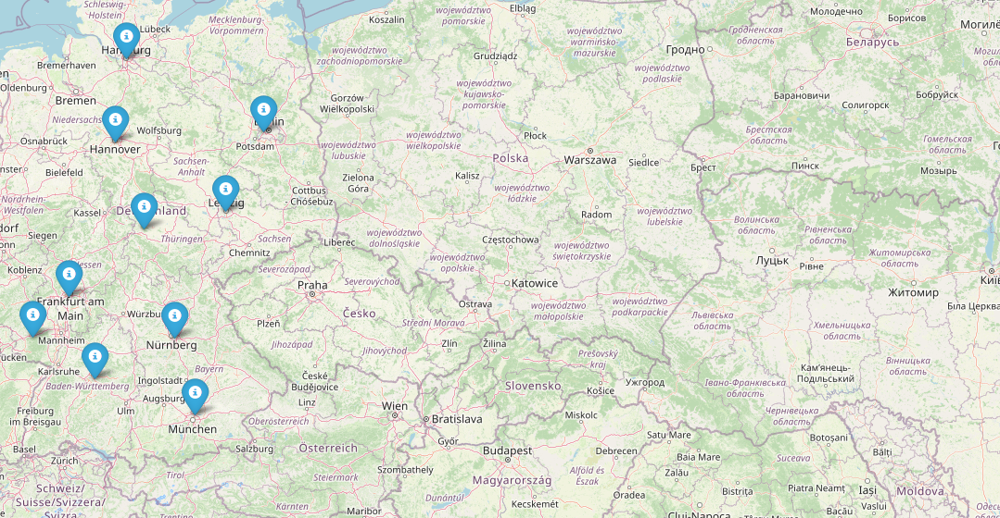

# Movies Map Builder

Movies Map Builder is a Python package for creating map of movies recorded nearby.

## Summary

Such map represents locations of movies recorded near specidfied location.

## CL usage

Before usage put data file 'locations.list' in  data folder!

python main.py
Please enter a year you would like to have a map for: 2006
Please enter your location (format: lat, long): 49.83826, 24.02324

## HTML structure

HTML file consists of:
 - script and style tags in the head
 - on main div tag in body
 - script that controls locations added to map